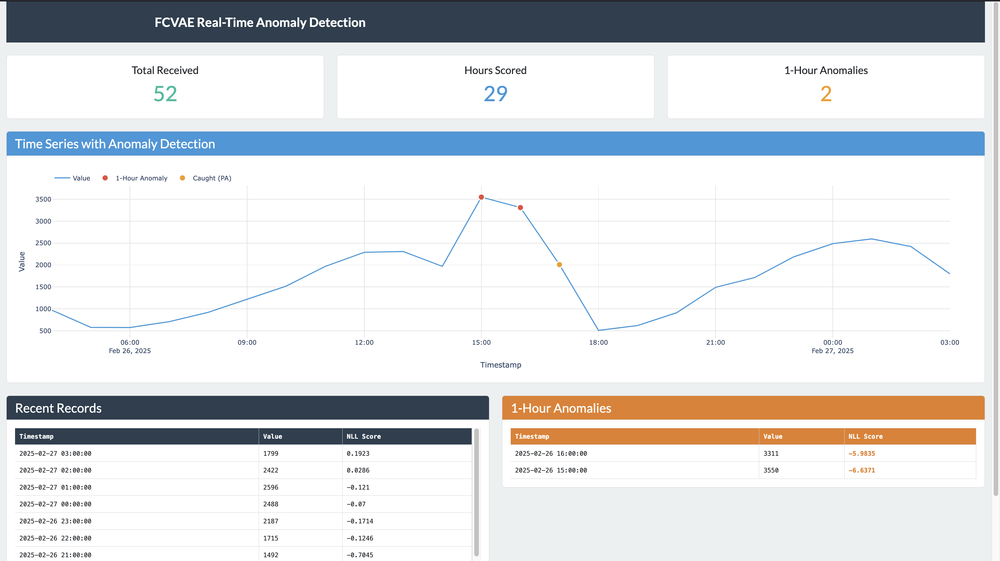
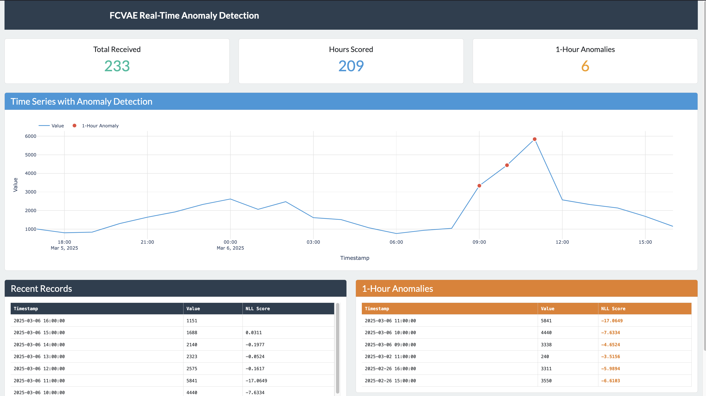

# FCVAE Anomaly Detection

Real-time anomaly detection on transaction frequency time series using a Frequency-enhanced Conditional VAE (FCVAE), streamed via Kafka + Spark and visualized with a Dash dashboard.

**Stack:** PyTorch | Apache Kafka | Apache Spark | Dash/Plotly | Docker Compose | UV

---

## Overview

The system monitors hourly transaction counts across 4 independent network/transaction-type combinations:

- **Accel / CMP** — Accelerator network, CMP transactions
- **Accel / no-pin** — Accelerator network, no-pin transactions
- **Star / CMP** — Star network, CMP transactions
- **Star / no-pin** — Star network, no-pin transactions

Each combo has its own trained FCVAE model, scaler, and calibrated threshold. The model scores incoming data in real time and flags anomalous hours on a live dashboard.

For full architectural details, see [TECHNICAL.md](TECHNICAL.md).

---

## How Scoring Works

The FCVAE reconstructs 24-hour sliding windows of normalized hourly transaction counts. The key insight is that position [-1] (the last hour) is **masked** during frequency conditioning — the Global Frequency Module excludes it from the FFT, and the Local Frequency Module zeros it out. This makes the last position the only **genuine prediction**; all other positions are reconstructions where the model already saw the values.

**Last-point NLL scoring:** Each hour, the model scores only the last position in the current 24-hour sliding window. The score is a negative log-likelihood (NLL) — lower (more negative) values indicate the model finds the observation more surprising, i.e., more anomalous.

**Anomaly decision:** If `last_point_score < threshold`, the hour is flagged as anomalous. The threshold is calibrated on a validation set by injecting synthetic spike and dip anomalies and optimizing for F1.

**Scoring method:** The detector uses MCMC mode 2 scoring with 16 latent samples averaged, providing stable scores suitable for low-latency streaming.

See [TECHNICAL.md sections 1, 3, 6](TECHNICAL.md) for full details on the architecture, scoring system, and streaming detector.

---

## Detection Examples

The dashboard shows a time series of hourly transaction counts with real-time anomaly markers:
- **Red dots** — Hours where the model's last-point NLL score crosses below the threshold (direct detection)
- **Orange dots** — Ground-truth anomaly hours caught by point-adjusted (PA) credit within a detected segment

### Spike Anomaly (Test Day 1)



Transaction count spikes to ~3500 at hours 15-16 (normal range: ~1000-2000). The model flags 2 hours as 1-hour anomalies (red dots), with NLL scores like -5.98 and -6.43 compared to ~0 for normal hours. An additional hour is caught via PA credit (orange dot), confirming segment-level detection.

### Dip/Outage Anomaly (Test Day 5)


Transaction volume drops to ~248 at the combo's peak hour (normal: ~1000-2000), simulating an outage. The model detects the anomalous drop with 3 flagged hours. This demonstrates the model's ability to detect volume drops, not just spikes — enabled by balanced threshold calibration with both spike and dip anomalies in the validation set.

### Sustained Spike (Test Day 9)



A multi-hour spike ramps up to ~5800 across hours 9-12. Each anomalous hour is independently flagged by the model with very negative NLL scores (-17.06, -7.63), showing high confidence. The dashboard accumulates 6 total 1-hour anomalies, demonstrating sustained anomaly tracking.

---

## Prerequisites

- **Docker** and **Docker Compose** v2+ (for containerized deployment)
- **UV** package manager (for local development)
- **Python 3.11+** (for local development)
- **Git**

---

## Quick Start (Docker)

```bash
# Clone the repo
git clone <repo-url> && cd fcvae-anomaly-detection

# Build all containers
docker compose build

# Start all services
docker compose up -d

# Check service health
docker compose ps

# View app logs
docker compose logs -f app

# Access the dashboard
open http://localhost:8050

# Stop all services
docker compose down
```

The producer waits for the app's `/health` endpoint before streaming data, so services start in the correct order automatically.

---

## Configuration

Key environment variables (set in `docker-compose.yml` or passed via shell):

| Variable | Default | Description |
|----------|---------|-------------|
| `COMBO` | `Accel_nopin` | Model to load: `Accel_CMP`, `Accel_nopin`, `Star_CMP`, `Star_nopin` |
| `MODEL_PATH` | `models/fcvae` | Directory containing trained model artifacts |
| `MESSAGE_DELAY_SECONDS` | `1` | Seconds between producer messages |
| `DATA_SPLIT` | `test` | Data split to stream: `train`, `val`, `test` |
| `LOOP_DATA` | `false` | Loop data continuously after reaching the end |
| `WINDOW_SIZE` | `24` | Hours per detection window |
| `MIN_SAMPLES` | `24` | Minimum samples before detection starts |
| `N_SAMPLES` | `16` | Latent samples for NLL scoring |

Switch combos:

```bash
COMBO=Star_CMP docker compose up -d
```

---

## Local Development Setup

### Install UV

```bash
curl -LsSf https://astral.sh/uv/install.sh | sh
```

### Install Dependencies

```bash
# App dependencies
cd app && uv sync && cd ..

# Producer dependencies
cd producer && uv sync && cd ..
```

### Generate Synthetic Data

```bash
uv run python data/generate_transactions.py split \
    --output data/synthetic_transactions.csv
```

### Train Models

```bash
uv run python -m app.train_fcvae \
    --data-path data/synthetic_transactions.csv \
    --output-dir models/fcvae \
    --kl-warmup-epochs 35 \
    --epochs 75
```

### Evaluate

```bash
uv run python -m app.evaluate_fcvae detailed \
    --model-dir models/fcvae \
    --output-dir plots/fcvae \
    --streaming-sim
```

---

## Project Structure

```
fcvae-anomaly-detection/
├── docker-compose.yml           # Docker orchestration (6 services)
├── README.md                    # This file
├── TECHNICAL.md                 # Detailed architecture reference
│
├── app/                         # Main application
│   ├── Dockerfile
│   ├── pyproject.toml
│   ├── main.py                  # Dash dashboard + Spark streaming
│   ├── fcvae_model.py           # FCVAE architecture (GFM, LFM, VAE)
│   ├── fcvae_scorer.py          # NLL scoring + threshold calibration
│   ├── fcvae_registry.py        # Multi-combo model management
│   ├── fcvae_streaming_detector.py  # Real-time detector
│   ├── base_detector.py         # Abstract detector interface
│   ├── attention.py             # Transformer attention modules
│   ├── train_fcvae.py           # Training pipeline
│   ├── fcvae_augment.py         # Data augmentation
│   └── evaluate_fcvae.py        # Evaluation + visualization
│
├── producer/                    # Kafka data producer
│   ├── Dockerfile
│   ├── pyproject.toml
│   └── producer.py              # Streams CSV data to Kafka
│
├── data/                        # Data generation
│   └── generate_transactions.py
│
└── models/                      # Trained model artifacts
    └── fcvae/
        ├── registry_config.pkl
        ├── oracle_thresholds.json
        ├── Accel_CMP/           # model.pt, scorer.pkl, scaler.pkl
        ├── Accel_nopin/
        ├── Star_CMP/
        └── Star_nopin/
```

---

## Architecture Overview

```
Producer ──► Kafka (anomaly_stream) ──► Spark Structured Streaming ──► FCVAE Detector ──► Dash Dashboard
              ▲                                                            │
              │                                                            ▼
         Zookeeper                                                  http://localhost:8050
```

1. **Producer** reads hourly transaction counts from CSV and publishes JSON messages to Kafka
2. **Spark Structured Streaming** consumes micro-batches from the Kafka topic
3. **FCVAE Detector** scores each new hour's 24-hour sliding window using last-point NLL
4. **Dash Dashboard** displays the time series with real-time anomaly markers and score tables

---

## Further Reading

See [TECHNICAL.md](TECHNICAL.md) for:

- Core FCVAE architecture (GFM, LFM, VAE) and last-point masking
- Scoring system details (NLL semantics, threshold methods, decision modes)
- Data augmentation strategies (point, segment, missing data)
- Streaming detector implementation
- Training pipeline with KL annealing
- Complete data flow diagrams
- Full configuration reference with hyperparameter ranges
