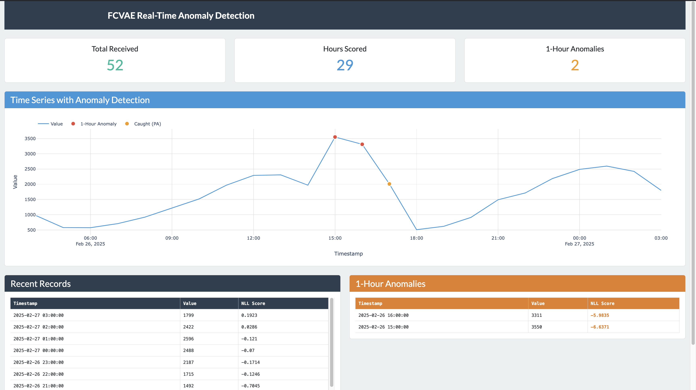
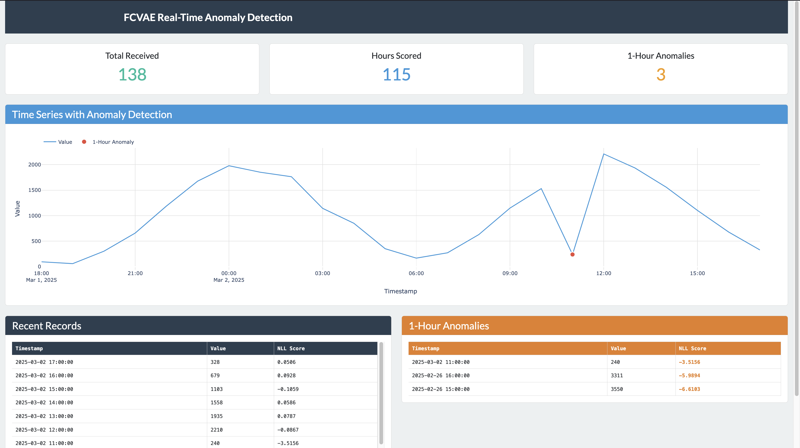
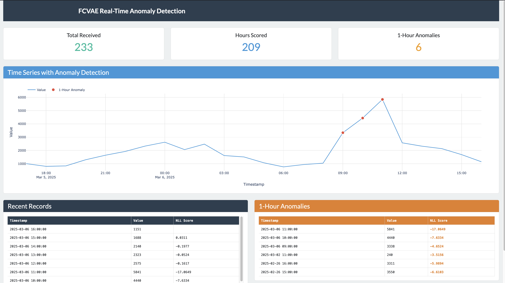

# FCVAE Anomaly Detection

Real-time anomaly detection on transaction frequency time series using a Frequency-enhanced Conditional VAE (FCVAE), streamed via Kafka + Spark and visualized with a Dash dashboard.

**Stack:** PyTorch | FastAPI | Apache Kafka | Apache Spark | Dash/Plotly | Docker Compose | UV

---

## Table of Contents

- [Overview](#overview)
- [How Scoring Works](#how-scoring-works)
- [Run Paths](#run-paths)
- [Detection Examples](#detection-examples)
- [Scoring API](#scoring-api)
  - [API-only Quick Start (Local)](#api-only-quick-start-local)
  - [API-only Docker Quick Start](#api-only-docker-quick-start)
  - [Streaming Demo](#streaming-demo)
  - [API Configuration](#api-configuration)
- [Prerequisites](#prerequisites)
- [Full Stack Docker Quick Start](#full-stack-docker-quick-start)
- [Configuration](#configuration)
- [Local Development Setup](#local-development-setup)
- [Project Structure](#project-structure)
- [Architecture Overview](#architecture-overview)
- [Further Reading](#further-reading)

---

## Overview

The system monitors hourly transaction counts across 4 independent network/transaction-type combinations:

- **Accel / CMP** — Accelerator network, CMP transactions
- **Accel / no-pin** — Accelerator network, no-pin transactions
- **Star / CMP** — Star network, CMP transactions
- **Star / no-pin** — Star network, no-pin transactions

Each combo has its own trained FCVAE model, scaler, and calibrated threshold. The model scores incoming data in real time and flags anomalous hours on a live dashboard.

For full architectural details, see [TECHNICAL.md](TECHNICAL.md).

---

## How Scoring Works

The FCVAE reconstructs 24-hour sliding windows of normalized hourly transaction counts. The key insight is that position [-1] (the last hour) is **masked** during frequency conditioning — the Global Frequency Module excludes it from the FFT, and the Local Frequency Module zeros it out. This makes the last position the only **genuine prediction**; all other positions are reconstructions where the model already saw the values.

**Last-point NLL scoring:** Each hour, the model scores only the last position in the current 24-hour sliding window. The score is a negative log-likelihood (NLL) — lower (more negative) values indicate the model finds the observation more surprising, i.e., more anomalous.

**Anomaly decision:** If `last_point_score < threshold`, the hour is flagged as anomalous. The threshold is calibrated on a validation set by injecting synthetic spike and dip anomalies and optimizing for F1.

**Scoring method:** The detector uses MCMC mode 2 scoring with 16 latent samples averaged, providing stable scores suitable for low-latency streaming.

See [TECHNICAL.md sections 1, 3, 6](TECHNICAL.md) for full details on the architecture, scoring system, and streaming detector.

---

## Run Paths

| Path | What it does | Section |
|------|-------------|---------|
| **API-only** | Score windows via REST — no Kafka/Spark needed | [Local](#api-only-quick-start-local) / [Docker](#api-only-docker-quick-start) |
| **Full streaming stack** | Kafka + Spark + Dash dashboard for real-time monitoring | [Full Stack Docker Quick Start](#full-stack-docker-quick-start) |
| **Train / evaluate** | Generate data, train FCVAE models, run evaluation | [Local Development Setup](#local-development-setup) |

> **Fastest first success** — verify the API works in under 60 seconds:
>
> ```bash
> docker compose build api && docker compose up -d api
> curl http://localhost:8000/health
> curl -X POST http://localhost:8000/v1/score \
>   -H "Content-Type: application/json" \
>   -d '{"combo": "Accel_CMP", "values": [1023,1150,987,1102,1045,998,1200,1350,1500,1420,1380,1290,1150,1080,1020,980,950,1010,1100,1200,1150,1050,1000,1020]}'
> ```

---

## Detection Examples

The dashboard shows a time series of hourly transaction counts with real-time anomaly markers:
- **Red dots** — Hours where the model's last-point NLL score crosses below the threshold (direct detection)
- **Orange dots** — Ground-truth anomaly hours caught by point-adjusted (PA) credit within a detected segment

### Spike Anomaly (Test Day 1)



Transaction count spikes to ~3500 at hours 15-16 (normal range: ~1000-2000). The model flags 2 hours as 1-hour anomalies (red dots), with NLL scores like -5.98 and -6.43 compared to ~0 for normal hours. An additional hour is caught via PA credit (orange dot), confirming segment-level detection.

### Dip/Outage Anomaly (Test Day 5)



Transaction volume drops to ~248 at the combo's peak hour (normal: ~1000-2000), simulating an outage. The model detects the anomalous drop with 3 flagged hours. This demonstrates the model's ability to detect volume drops, not just spikes — enabled by balanced threshold calibration with both spike and dip anomalies in the validation set.

### Sustained Spike (Test Day 9)



A multi-hour spike ramps up to ~5800 across hours 9-12. Each anomalous hour is independently flagged by the model with very negative NLL scores (-17.06, -7.63), showing high confidence. The dashboard accumulates 6 total 1-hour anomalies, demonstrating sustained anomaly tracking.

---

## Scoring API

The FCVAE scoring logic is also exposed as a standalone **FastAPI REST service** in `api/`. This is the production-grade interface for external callers (Striim, custom pipelines, etc.) to score transaction windows over HTTP without needing Kafka or Spark.

### Endpoints

| Endpoint | Method | Description |
|----------|--------|-------------|
| `/v1/score` | POST | Score a single 24-hour window for one combo |
| `/v1/score/batch` | POST | Score multiple windows in a single call |
| `/health` | GET | Service health and per-combo model load status |
| `/v1/model/info` | GET | Model configuration, thresholds, and scorer metadata |

### API-only Quick Start (Local)

```bash
# Install dependencies
cd api && uv sync && cd ..

# Start the API server
PYTHONPATH=app:$PYTHONPATH api/.venv/bin/uvicorn api.main:app --port 8000

# Score a window
curl -X POST http://localhost:8000/v1/score \
  -H "Content-Type: application/json" \
  -d '{
    "combo": "Accel_nopin",
    "values": [1023,1150,987,1102,1045,998,1200,1350,1500,1420,1380,1290,1150,1080,1020,980,950,1010,1100,1200,1150,1050,1000,1020]
  }'
```

Interactive API docs are available at `http://localhost:8000/docs`.

### API-only Docker Quick Start

```bash
docker compose build api
docker compose up api

# Score against the container
curl -X POST http://localhost:8000/v1/score \
  -H "Content-Type: application/json" \
  -d '{"combo": "Accel_CMP", "values": [1023,1150,987,1102,1045,998,1200,1350,1500,1420,1380,1290,1150,1080,1020,980,950,1010,1100,1200,1150,1050,1000,1020]}'
```

The API service has no dependency on Kafka or Spark — it can run completely standalone.

### Streaming Demo

`api/demo_stream.py` simulates the real-time scoring workflow by sliding a 24-hour window across the test data and calling the API for each new hour:

```bash
# Start the API in one terminal
PYTHONPATH=app:$PYTHONPATH api/.venv/bin/uvicorn api.main:app --port 8000

# Run the streaming demo in another terminal
PYTHONPATH=app:$PYTHONPATH api/.venv/bin/python -m api.demo_stream
```

Options:

| Flag | Default | Description |
|------|---------|-------------|
| `--combo` | `Accel_nopin` | Combo to score |
| `--delay` | `0.5` | Seconds between API calls (simulates real-time) |
| `--split` | `test` | Data split: `train`, `val`, `test` |
| `--no-color` | off | Disable ANSI color output |

The demo prints a live table showing each scored hour with its NLL score, threshold, anomaly decision, and ground-truth label — matching the behavior of the Dash dashboard.

### API Configuration

All settings are overridable via `FCVAE_`-prefixed environment variables (see `.env.example`):

| Variable | Default | Description |
|----------|---------|-------------|
| `FCVAE_MODEL_PATH` | `models/fcvae` | Path to trained model artifacts |
| `FCVAE_MODEL_VERSION` | `1.0.0` | Version tag returned in responses |
| `FCVAE_N_SAMPLES` | `16` | Latent samples for NLL scoring |
| `FCVAE_SCORE_MODE` | `single_pass` | `single_pass` or `mcmc` |
| `FCVAE_DEVICE` | `cpu` | `cpu` or `cuda` |
| `FCVAE_API_KEY` | `` | API key for auth (empty = no auth) |
| `FCVAE_LOG_LEVEL` | `INFO` | Log level |

For full architectural details, see [TECHNICAL.md section 11](TECHNICAL.md).

---

## Prerequisites

- **Docker** and **Docker Compose** v2+ (for containerized deployment)
- **UV** package manager (for local development)
- **Python 3.11+** (for local development)
- **Git**

---

## Full Stack Docker Quick Start

```bash
# Clone the repo
git clone <repo-url> && cd fcvae-anomaly-detection

# Build all containers
docker compose build

# Start all services
docker compose up -d

# Check service health
docker compose ps

# View app logs
docker compose logs -f app

# Access the dashboard
open http://localhost:8050

# Stop all services
docker compose down
```

The producer waits for the app's `/health` endpoint before streaming data, so services start in the correct order automatically.

---

## Configuration

Key environment variables (set in `docker-compose.yml` or passed via shell):

| Variable | Default | Description |
|----------|---------|-------------|
| `COMBO` | `Accel_nopin` | Model to load: `Accel_CMP`, `Accel_nopin`, `Star_CMP`, `Star_nopin` |
| `MODEL_PATH` | `models/fcvae` | Directory containing trained model artifacts |
| `MESSAGE_DELAY_SECONDS` | `1` | Seconds between producer messages |
| `DATA_SPLIT` | `test` | Data split to stream: `train`, `val`, `test` |
| `LOOP_DATA` | `false` | Loop data continuously after reaching the end |
| `WINDOW_SIZE` | `24` | Hours per detection window |
| `MIN_SAMPLES` | `24` | Minimum samples before detection starts |
| `N_SAMPLES` | `16` | Latent samples for NLL scoring |

Switch combos:

```bash
COMBO=Star_CMP docker compose up -d
```

---

## Local Development Setup

### Install UV

```bash
curl -LsSf https://astral.sh/uv/install.sh | sh
```

### Install Dependencies

```bash
# App dependencies
cd app && uv sync && cd ..

# Producer dependencies
cd producer && uv sync && cd ..
```

### Generate Synthetic Data

```bash
uv run python data/generate_transactions.py split \
    --output data/synthetic_transactions.csv
```

### Train Models

```bash
uv run python -m app.train_fcvae \
    --data-path data/synthetic_transactions.csv \
    --output-dir models/fcvae \
    --kl-warmup-epochs 35 \
    --epochs 75
```

### Evaluate

```bash
uv run python -m app.evaluate_fcvae detailed \
    --model-dir models/fcvae \
    --output-dir plots/fcvae \
    --streaming-sim
```

---

## Project Structure

```
fcvae-anomaly-detection/
├── docker-compose.yml           # Docker orchestration (7 services)
├── .env.example                 # Environment variable documentation
├── README.md                    # This file
├── TECHNICAL.md                 # Detailed architecture reference
├── PLAN.md                      # Implementation plan (Steps 1-4)
│
├── app/                         # Dash dashboard + model code
│   ├── Dockerfile
│   ├── pyproject.toml
│   ├── main.py                  # Dash dashboard + Spark streaming
│   ├── fcvae_model.py           # FCVAE architecture (GFM, LFM, VAE)
│   ├── fcvae_scorer.py          # NLL scoring + threshold calibration
│   ├── fcvae_registry.py        # Multi-combo model management
│   ├── fcvae_streaming_detector.py  # Real-time detector
│   ├── base_detector.py         # Abstract detector interface
│   ├── attention.py             # Transformer attention modules
│   ├── train_fcvae.py           # Training pipeline
│   ├── fcvae_augment.py         # Data augmentation
│   └── evaluate_fcvae.py        # Evaluation + visualization
│
├── api/                         # FastAPI scoring service
│   ├── Dockerfile
│   ├── pyproject.toml
│   ├── main.py                  # FastAPI app with lifespan model loading
│   ├── schemas.py               # Pydantic request/response models
│   ├── dependencies.py          # Model store, settings, detector lifecycle
│   ├── demo_stream.py           # Streaming demo (sliding window over test data)
│   └── routers/
│       ├── scoring.py           # POST /v1/score, POST /v1/score/batch
│       └── health.py            # GET /health, GET /v1/model/info
│
├── producer/                    # Kafka data producer
│   ├── Dockerfile
│   ├── pyproject.toml
│   └── producer.py              # Streams CSV data to Kafka
│
├── data/                        # Data generation
│   └── generate_transactions.py
│
└── models/                      # Trained model artifacts
    └── fcvae/
        ├── registry_config.pkl
        ├── oracle_thresholds.json
        ├── Accel_CMP/           # model.pt, scorer.pkl, scaler.pkl
        ├── Accel_nopin/
        ├── Star_CMP/
        └── Star_nopin/
```

---

## Architecture Overview

The system provides two independent interfaces to the same FCVAE scoring engine:

### Streaming Pipeline (Dash Dashboard)

```
Producer ──► Kafka (anomaly_stream) ──► Spark Structured Streaming ──► FCVAE Detector ──► Dash Dashboard
              ▲                                                            │
              │                                                            ▼
         Zookeeper                                                  http://localhost:8050
```

1. **Producer** reads hourly transaction counts from CSV and publishes JSON messages to Kafka
2. **Spark Structured Streaming** consumes micro-batches from the Kafka topic
3. **FCVAE Detector** scores each new hour's 24-hour sliding window using last-point NLL
4. **Dash Dashboard** displays the time series with real-time anomaly markers and score tables

### REST API (FastAPI Scoring Service)

```
Any caller ──► FastAPI (/v1/score) ──► FCVAEStreamingDetector ──► JSON response
 (Striim,                                    │
  curl,        http://localhost:8000     All 4 combo models
  etc.)                                 loaded at startup
```

1. **Caller** sends a 24-value window + combo key via HTTP POST
2. **FastAPI** validates the request, routes to the correct combo detector
3. **FCVAEStreamingDetector** normalizes, scores via MCMC mode 2, and applies threshold
4. **Response** returns `is_anomaly`, `last_point_score`, `threshold`, and all 24 position scores

---

## Further Reading

See [TECHNICAL.md](TECHNICAL.md) for:

- Core FCVAE architecture (GFM, LFM, VAE) and last-point masking
- Scoring system details (NLL semantics, threshold methods, decision modes)
- Data augmentation strategies (point, segment, missing data)
- Streaming detector implementation
- Training pipeline with KL annealing
- **Scoring API architecture** (endpoints, request flow, configuration)
- Complete data flow diagrams
- Full configuration reference with hyperparameter ranges

See [PLAN.md](PLAN.md) for the full implementation plan including future Striim integration (Steps 3-4).
