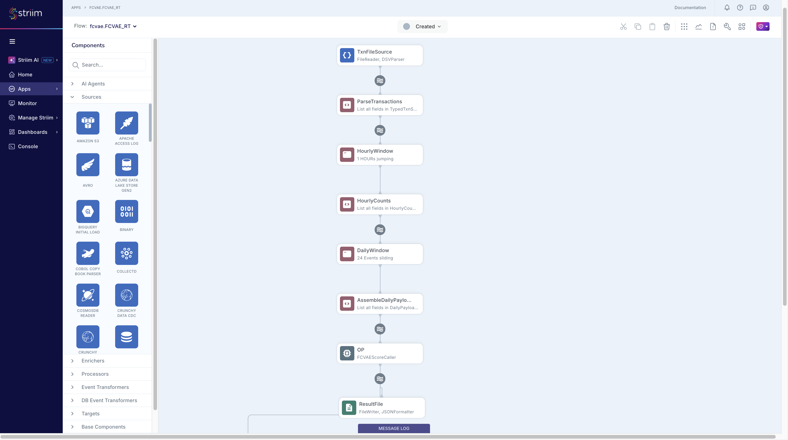

# Striim FCVAE Anomaly Detection Pipeline: Setup Guide

**Striim Version:** Platform 5.2.0.4 (OpenJDK 11)
**Pipeline:** FileReader -> Parse CQ -> Hourly Jumping Window -> 24-Hour Sliding Window -> Open Processor (FCVAE API) -> FileWriter (JSON)

This guide walks through setting up the end-to-end Striim FCVAE anomaly detection pipeline. The pipeline ingests synthetic transaction data, aggregates hourly counts per network/verification combo, assembles 24-hour sliding window payloads, and scores each window against a pre-trained Frequency-Enhanced Conditional VAE model via HTTP.

This uses the **typed-stream approach** (not the WAEvent pass-through pattern) because the pipeline requires Striim's native windowing and aggregation CQs upstream of the Open Processor. This requires a types JAR, `CREATE TYPE` statements, and the JAR removal trick for deployment.

The Open Processor and types JAR are pre-built in this repository. You do not need to compile anything.

---

## Table of Contents

1. [Prerequisites](#1-prerequisites)
2. [Start the Scoring API](#2-start-the-scoring-api)
3. [Deploy to Striim](#3-deploy-to-striim)
4. [Wire the Open Processor in Flow Designer](#4-wire-the-open-processor-in-flow-designer)
5. [Run and Verify](#5-run-and-verify)
6. [Results](#6-results)
7. [Teardown and Re-runs](#7-teardown-and-re-runs)

---

## 1. Prerequisites

| Requirement | Detail |
|---|---|
| Striim Platform | 5.2.0.4, installed at `$STRIIM_HOME` (e.g. `/opt/Striim`) |
| Java | OpenJDK 11 |
| Python | 3.11+ with `fastapi`, `uvicorn`, `torch`, `numpy`, `scikit-learn`, `pandas` |

Set `STRIIM_HOME`:

```bash
export STRIIM_HOME="/opt/Striim"
```

Pre-built artifacts in this repo:

| Artifact | Path | Purpose |
|---|---|---|
| OP module (.scm) | `striim/fcvae-score-caller/target/FCVAEScoreCaller.jar` | Striim Open Processor (fat JAR, typed streams) |
| Types JAR | `striim/lib/fcvae_types.jar` | Striim-exported `_1_0` type classes for `$STRIIM_HOME/lib/` |
| TQL | `striim/FCVAE.tql` | Striim application definition |
| Data | `data/synthetic_transactions_phase2.csv` | Synthetic transaction data (~27.5 hours, 4 combos) |
| Scoring API | `code/3_streaming_app.py` | FastAPI service wrapping all 5 FCVAE models |

---

## 2. Start the Scoring API

```bash
cd <repo>
uv run python code/3_streaming_app.py
```

Or with Docker:

```bash
docker compose up --build
```

Verify:

```bash
curl -s http://localhost:8000/health
```

Expected: `"status": "healthy"` with all four combos loaded (Accel_CMP, Accel_nopin, Star_CMP, Star_nopin).

---

## 3. Deploy to Striim

This pipeline uses typed streams, which requires the **JAR removal trick**: the types JAR must be absent from `lib/` when creating types (to avoid "class already exists" errors), then restored before loading the OP.

### 3.1 Install artifacts and stop Striim

```bash
cp <repo>/striim/fcvae-score-caller/target/FCVAEScoreCaller.jar $STRIIM_HOME/modules/FCVAEScoreCaller.scm
cp <repo>/striim/lib/fcvae_types.jar $STRIIM_HOME/lib/fcvae_types.jar
```

If Striim is running, stop it with Ctrl+C.

### 3.2 JAR removal trick

```bash
mv $STRIIM_HOME/lib/fcvae_types.jar /tmp/fcvae_types.jar
$STRIIM_HOME/bin/server.sh
```

### 3.3 Create namespace, types, and import TQL

In the Striim console:

```sql
CREATE NAMESPACE fcvae;
USE fcvae;

CREATE TYPE ScorerResult (
  combo_key     String,
  is_anomaly    String,
  anomaly_score String,
  threshold     String,
  window_end    String
);

CREATE TYPE DailyPayloadStream_Type (
  combo_key    String,
  values_list  String,
  window_size  Integer,
  window_start java.lang.String,
  window_end   java.lang.String
);
```

Then paste the contents of `striim/FCVAE.tql` into the console (everything from `CREATE APPLICATION FCVAE` through `END APPLICATION FCVAE`).

### 3.4 Restore types JAR, restart, and load OP

Stop Striim with Ctrl+C, then:

```bash
mv /tmp/fcvae_types.jar $STRIIM_HOME/lib/fcvae_types.jar
$STRIIM_HOME/bin/server.sh
```

In the Striim console:

```sql
USE fcvae;
LOAD OPEN PROCESSOR "/opt/Striim/modules/FCVAEScoreCaller.scm";
```

Verify:

```sql
LIST OPENPROCESSORS;
```

---

## 4. Wire the Open Processor in Flow Designer

1. In the Striim web UI, open `fcvae.FCVAE` in **Flow Designer**
2. Drag **Open Processor** from Base Components into the workspace
3. Configure:
   - **Module:** `FCVAEScoreCaller`
   - **Input Stream:** `DailyPayloadStream`
   - **Output Stream:** `ScorerResultStream`
4. Click **Save**

The completed pipeline in Flow Designer:



---

## 5. Run and Verify

### 5.1 Deploy and start

```sql
USE fcvae;
DEPLOY APPLICATION fcvae.FCVAE;
START APPLICATION fcvae.FCVAE;
```

### 5.2 Copy data file (after app is running)

```bash
mkdir -p /tmp/fcvae_test
cp <repo>/data/synthetic_transactions_phase2.csv /tmp/fcvae_test/
```

### 5.3 Monitor

```bash
grep "FCVAEScoreCaller" $STRIIM_HOME/logs/striim.server.log | tail -10
```

```bash
cat /tmp/fcvae_test/scored_output.00
```

---

## 6. Results

With `synthetic_transactions_phase2.csv` (~50,000 rows, ~27.5 hours, 4 combos):

| Metric | Value |
|---|---|
| Combos scored | 4 (Accel_CMP, Accel_nopin, Star_CMP, Star_nopin) |
| Windows per combo | ~3-4 (sliding window emits after 24 hourly counts) |
| Threshold | Per-combo (NLL-based, F1-calibrated) |

### Example JSON output

```json
{
  "combo_key": "Star_CMP",
  "is_anomaly": "false",
  "anomaly_score": "-0.31990835070610046",
  "threshold": "-1.756",
  "window_end": "2025/02/25 23:01:02.000"
}
```

All four combos should appear in the output. With normal synthetic data, scores are above their respective thresholds (not anomalous).

---

## 7. Teardown and Re-runs

### Stop the application

```sql
USE fcvae;
STOP APPLICATION fcvae.FCVAE;
UNDEPLOY APPLICATION fcvae.FCVAE;
```

### Re-run with same data

```bash
rm -f /tmp/fcvae_test/scored_output*
rm -f /tmp/fcvae_test/synthetic_transactions*.csv
```

Then redeploy and start, and copy data with a new filename:

```sql
DEPLOY APPLICATION fcvae.FCVAE;
START APPLICATION fcvae.FCVAE;
```

```bash
cp <repo>/data/synthetic_transactions_phase2.csv /tmp/fcvae_test/synthetic_transactions_phase2_run2.csv
```

### Full reset

```sql
USE fcvae;
STOP APPLICATION fcvae.FCVAE;
UNDEPLOY APPLICATION fcvae.FCVAE;
DROP APPLICATION fcvae.FCVAE CASCADE;
DROP TYPE fcvae.ScorerResult;
DROP TYPE fcvae.DailyPayloadStream_Type;
USE admin;
UNLOAD OPEN PROCESSOR "/opt/Striim/modules/FCVAEScoreCaller.scm";
DROP NAMESPACE fcvae;
```

Stop Striim, then:

```bash
rm -f $STRIIM_HOME/.striim/OpenProcessor/FCVAEScoreCaller.scm
rm -f $STRIIM_HOME/modules/FCVAEScoreCaller.scm
rm -f $STRIIM_HOME/lib/fcvae_types.jar
rm -f /tmp/fcvae_test/scored_output*
rm -f /tmp/fcvae_test/synthetic_transactions*.csv
$STRIIM_HOME/bin/server.sh
```

Then start from [Step 3](#3-deploy-to-striim).

---

## Deployment Order (Quick Reference)

```
 1. Start scoring API         uv run python code/3_streaming_app.py
 2. Copy .scm + types JAR     cp to $STRIIM_HOME/modules/ and $STRIIM_HOME/lib/
 3. Stop Striim               Ctrl+C
 4. Remove types JAR           mv $STRIIM_HOME/lib/fcvae_types.jar /tmp/
 5. Start Striim              $STRIIM_HOME/bin/server.sh
 6. CREATE types              CREATE NAMESPACE fcvae; USE fcvae; CREATE TYPE ...
 7. Paste TQL                 CREATE APPLICATION FCVAE; ... END APPLICATION;
 8. Stop Striim               Ctrl+C
 9. Restore types JAR         mv /tmp/fcvae_types.jar $STRIIM_HOME/lib/
10. Start Striim              $STRIIM_HOME/bin/server.sh
11. LOAD OP                   LOAD OPEN PROCESSOR "/opt/Striim/modules/FCVAEScoreCaller.scm";
12. Wire OP in Flow Designer  DailyPayloadStream -> FCVAEScoreCaller -> ScorerResultStream
13. Deploy + Start + Data     DEPLOY; START; cp data to /tmp/fcvae_test/
```

---

## Data Flow

```
TxnFileSource (FileReader + DSVParser, watches /tmp/fcvae_test/)
    |
    v
RawTxnStream (WAEvent: data[0]=timestamp, data[1]=network, data[2]=txn_type, ...)
    |
    v
ParseTransactions CQ (builds combo_key = network + "_" + txn_type, parses timestamp)
    |
    v
TypedTxnStream (combo_key, txn_timestamp)
    |
    v
HourlyWindow (1-hour jumping, PARTITION BY combo_key, ON txn_timestamp)
    |
    v
HourlyCounts CQ (COUNT per combo per hour)
    |
    v
HourlyCountStream (combo_key, txn_count, hour_start, hour_end)
    |
    v
DailyWindow (KEEP 24 ROWS, PARTITION BY combo_key)
    |
    v
AssembleDailyPayload CQ (LIST() of 24 counts, HAVING COUNT >= 24)
    |
    v
DailyPayloadStream OF fcvae.DailyPayloadStream_Type
    |
    v
FCVAEScoreCaller OP (HTTP POST to localhost:8000/v1/score)
    |
    v
ScorerResultStream OF fcvae.ScorerResult
    |
    v
ResultFile (FileWriter + JSONFormatter -> /tmp/fcvae_test/scored_output)
```

---

## Environment Reference

| Component | Detail |
|---|---|
| Striim Platform | 5.2.0.4 at `$STRIIM_HOME` |
| Scoring API | `http://localhost:8000` (endpoint: `/score`) |
| Namespace | `fcvae` |
| Application | `fcvae.FCVAE` |
| OP module | `FCVAEScoreCaller` |
| Types JAR | `$STRIIM_HOME/lib/fcvae_types.jar` (must be present at boot) |
| Data file | `data/synthetic_transactions_phase2.csv` (copy to `/tmp/fcvae_test/` after app starts) |
| Output | `/tmp/fcvae_test/scored_output.00`, `.01`, etc. |
| Striim logs | `$STRIIM_HOME/logs/striim.server.log` |
| Window sizes | 1-hour jumping (aggregation), 24-row sliding (payload assembly) |
| Partitioning | `combo_key` (4 combos: Accel_CMP, Accel_nopin, Star_CMP, Star_nopin) |
| Scoring | NLL-based, F1-calibrated per-combo thresholds |
| Annotation types | `DailyPayloadStream_Type_1_0` (input), `ScorerResult_1_0` (output) |